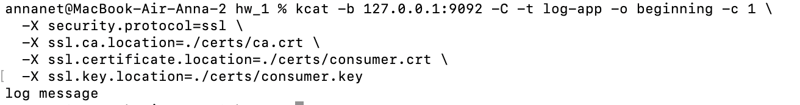
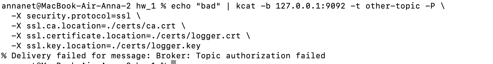
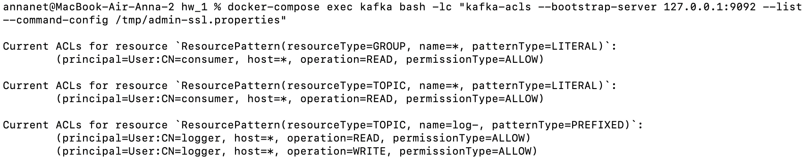
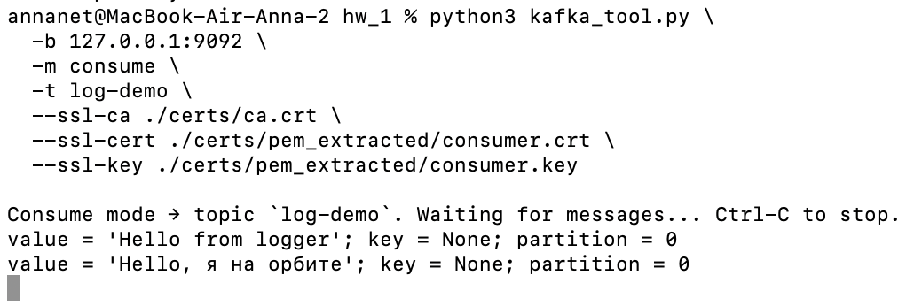
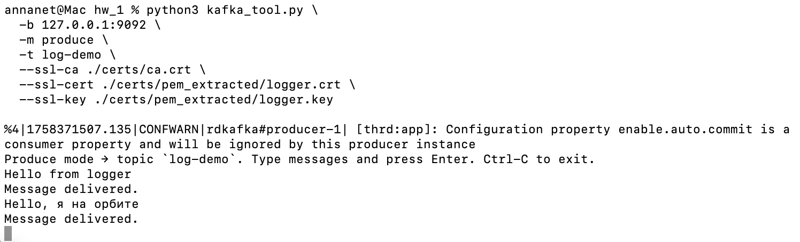
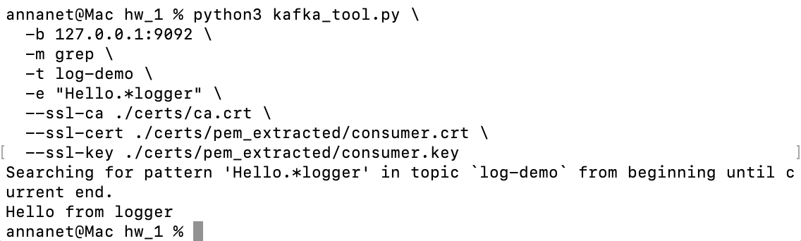
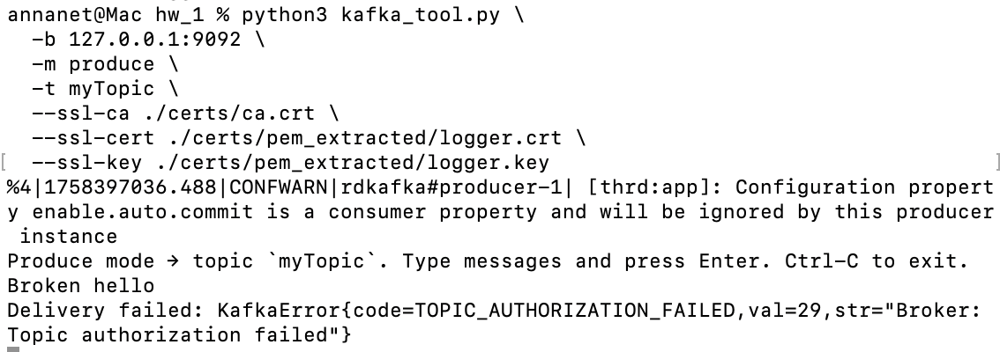
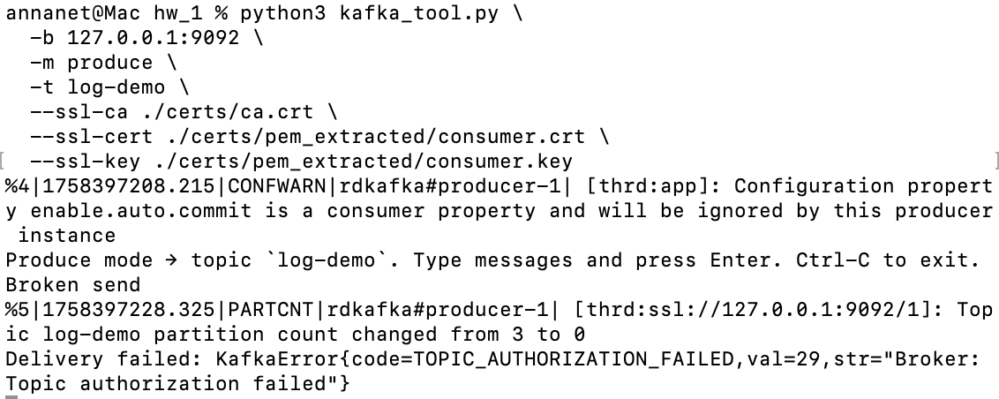

# Задача 1 — Kafka + SSL + ACL

## Что в репозитории
- `docker-compose.yml` — содержит zookeeper и kafka с SSL + ACL.
- `certs/generate-certs.sh` — скрипт для генерации CA, server keystore и client keystores (admin, logger, consumer) и truststore.
- `create-acls.sh` — скрипт для добавления ACL’ов через admin-клиент.

---

## Шаги воспроизведения (как проверить у себя)

### 1. Сгенерировать сертификаты
```bash
chmod +x certs/generate-certs.sh
cd certs/
./certs/generate-certs.sh
# Скрипт создаст: server.keystore.p12, client.truststore.jks, admin.p12, logger.p12, consumer.p12, ca.crt, server1.creds
```

### 2. Запустить docker-compose
```bash
docker-compose up -d
docker-compose logs -f kafka
```

### 3. Добавить ACL’ы (как admin)
```bash
chmod +x create-acls.sh
./create-acls.sh
# Скрипт использует admin.p12 для выполнения kafka-acls и создаёт:
# - logger: Read+Write на топики prefixed log-
# - consumer: Read на топики и Read на группы
```

## Тесты и результаты
Выполняем:
```bash
openssl pkcs12 -in certs/logger.p12 -clcerts -nokeys -out certs/logger.crt -passin pass:client1
openssl pkcs12 -in certs/logger.p12 -nocerts -nodes -out certs/logger.key -passin pass:client1
chmod 600 certs/logger.key

openssl pkcs12 -in certs/consumer.p12 -clcerts -nokeys -out certs/consumer.crt -passin pass:client1
openssl pkcs12 -in certs/consumer.p12 -nocerts -nodes -out certs/consumer.key -passin pass:client1
chmod 600 certs/consumer.key
```
### 1. Producer как logger (должен успешно записать в log-*)

Отправляем сообщение:
```bash
echo "log message" | kcat -b 127.0.0.1:9092 -t log-app -P \
  -X security.protocol=ssl \
  -X ssl.ca.location=./certs/ca.crt \
  -X ssl.certificate.location=./certs/logger.crt \
  -X ssl.key.location=./certs/logger.key
```
Док-во:


### 2. Producer как logger в другой топик (должен быть отказ)
Отправляем сообщение:
```bash
echo "bad" | kcat -b 127.0.0.1:9092 -t other-topic -P \
  -X security.protocol=ssl \
  -X ssl.ca.location=./certs/ca.crt \
  -X ssl.certificate.location=./certs/logger.crt \
  -X ssl.key.location=./certs/logger.key
```
Док-во:


### 3. Проверка ACL’ов (admin)
```bash
docker-compose exec kafka bash -lc "kafka-acls --bootstrap-server 127.0.0.1:9092 --list --command-config /tmp/admin-ssl.properties"
```
Док-во:


# Задача 2 - `kafka_tool.py`

> **Предположения**
>
> * Вы запускаете из корня проекта (там `docker-compose.yml` и папка `./certs`).
> * Скрипты: `./certs/generate-certs.sh`, `create-acls.sh` — присутствуют.
> * Пароли: `p12` → `client1`, truststore → `123456`, server keystore → `server1`.


## Инструкция по старту (да, опять, нужна воспроизводимость)
### Сгенерировать сертификаты
```bash
cd ./certs
chmod +x generate-certs.sh
./generate-certs.sh
cd ..
```

Проверка:
```bash
ls -l ./certs/{admin.p12,logger.p12,consumer.p12,client.truststore.jks,ca.crt,server.keystore.p12}
```

### Поднять Kafka + Zookeeper

```bash
docker-compose up -d
sleep 8
docker-compose logs --no-color --tail=100 kafka | sed -n '1,200p'
```

### Создать `/tmp/admin-ssl.properties` и применить ACL'ы

Сделать скрипт исполняемым и запустить:

```bash
chmod +x create-acls.sh
./create-acls.sh
```

Проверка:

```bash
docker-compose exec kafka ls -l /tmp/admin-ssl.properties
docker-compose exec kafka cat /tmp/admin-ssl.properties
```

### Создать тестовые темы (RF=1 — обязательно для single-broker)

```bash
docker-compose exec kafka kafka-topics --create \
  --bootstrap-server 127.0.0.1:9092 \
  --replication-factor 1 --partitions 3 --topic log-demo \
  --command-config /tmp/admin-ssl.properties

docker-compose exec kafka kafka-topics --create \
  --bootstrap-server 127.0.0.1:9092 \
  --replication-factor 1 --partitions 1 --topic myTopic \
  --command-config /tmp/admin-ssl.properties

docker-compose exec kafka kafka-topics --list --bootstrap-server 127.0.0.1:9092 --command-config /tmp/admin-ssl.properties
docker-compose exec kafka kafka-topics --describe --topic log-demo --bootstrap-server 127.0.0.1:9092 --command-config /tmp/admin-ssl.properties
```

### Дать `consumer` права чтения (точно на нужные темы) и права на группы

```bash
# consumer -> Read для myTopic (literal)
docker-compose exec kafka kafka-acls --bootstrap-server 127.0.0.1:9092 \
  --add --allow-principal User:CN=consumer --operation Read \
  --topic myTopic --resource-pattern-type literal \
  --command-config /tmp/admin-ssl.properties

# consumer -> Read для log-demo (literal)
docker-compose exec kafka kafka-acls --bootstrap-server 127.0.0.1:9092 \
  --add --allow-principal User:CN=consumer --operation Read \
  --topic log-demo --resource-pattern-type literal \
  --command-config /tmp/admin-ssl.properties

# consumer -> Read для consumer groups (чтобы иметь доступ к offsets)
docker-compose exec kafka kafka-acls --bootstrap-server 127.0.0.1:9092 \
  --add --allow-principal User:CN=consumer --operation Read \
  --group '*' \
  --command-config /tmp/admin-ssl.properties
```

> Примечание: `create-acls.sh` добавляет `logger` как Read/Write для `log-` (prefixed). Но `create-acls.sh` мог использовать `--topic '*' --resource-pattern-type literal` для consumer — это не даёт доступ ко всем темам. Поэтому мы явно добавляем Read для `myTopic` и `log-demo`.


### Проверка ACL'ов

```bash
docker-compose exec kafka kafka-acls --bootstrap-server 127.0.0.1:9092 --list --command-config /tmp/admin-ssl.properties | sed -n '1,300p'
```

Ожидаем увидеть:

* `User:CN=logger` — Read, Write для `ResourcePattern(topic, name=log-, patternType=PREFIXED)`
* `User:CN=consumer` — Read для `myTopic` и `log-demo` и Read для `GROUP '*'`

Я вижу:
```bash
annanet@Mac hw_1 % docker-compose exec kafka kafka-acls --bootstrap-server 127.0.0.1:9092 --list --command-config /tmp/admin-ssl.properties | sed -n '1,300p'
Current ACLs for resource `ResourcePattern(resourceType=TOPIC, name=myTopic, patternType=LITERAL)`: 
 	(principal=User:CN=consumer, host=*, operation=READ, permissionType=ALLOW) 

Current ACLs for resource `ResourcePattern(resourceType=TOPIC, name=log-demo, patternType=LITERAL)`: 
 	(principal=User:CN=consumer, host=*, operation=READ, permissionType=ALLOW) 

Current ACLs for resource `ResourcePattern(resourceType=TOPIC, name=*, patternType=LITERAL)`: 
 	(principal=User:CN=consumer, host=*, operation=READ, permissionType=ALLOW) 

Current ACLs for resource `ResourcePattern(resourceType=GROUP, name=*, patternType=LITERAL)`: 
 	(principal=User:CN=consumer, host=*, operation=READ, permissionType=ALLOW) 

Current ACLs for resource `ResourcePattern(resourceType=TOPIC, name=log-, patternType=PREFIXED)`: 
 	(principal=User:CN=logger, host=*, operation=WRITE, permissionType=ALLOW)
	(principal=User:CN=logger, host=*, operation=READ, permissionType=ALLOW) 
```

### Экспорт PEM-клиентов из PKCS12 (для `kafka_tool.py`)

```bash
mkdir -p ./certs/pem_extracted

# consumer
openssl pkcs12 -in ./certs/consumer.p12 -clcerts -nokeys -out ./certs/pem_extracted/consumer.crt -passin pass:client1
openssl pkcs12 -in ./certs/consumer.p12 -nocerts -nodes -out ./certs/pem_extracted/consumer.key -passin pass:client1
chmod 600 ./certs/pem_extracted/consumer.key

# logger
openssl pkcs12 -in ./certs/logger.p12 -clcerts -nokeys -out ./certs/pem_extracted/logger.crt -passin pass:client1
openssl pkcs12 -in ./certs/logger.p12 -nocerts -nodes -out ./certs/pem_extracted/logger.key -passin pass:client1
chmod 600 ./certs/pem_extracted/logger.key

ls -l ./certs/pem_extracted
```

---

## Примеры запуска (разделите на 3 терминала)

### Терминал A — Consumer (consumer: только read)

```bash
python3 kafka_tool.py \
  -b 127.0.0.1:9092 \
  -m consume \
  -t log-demo \
  --ssl-ca ./certs/ca.crt \
  --ssl-cert ./certs/pem_extracted/consumer.crt \
  --ssl-key ./certs/pem_extracted/consumer.key
```

Ожидаемый вывод:

```
Consume mode → topic `log-demo`. Waiting for messages... Ctrl-C to stop.
value = "Hello from logger"; key = None; partition = N
```

Я вижу:


### Терминал B — Producer (logger: write только в `log-*`)

```bash
python3 kafka_tool.py \
  -b 127.0.0.1:9092 \
  -m produce \
  -t log-demo \
  --ssl-ca ./certs/ca.crt \
  --ssl-cert ./certs/pem_extracted/logger.crt \
  --ssl-key ./certs/pem_extracted/logger.key
```

Ввести:

```
Hello from logger
```

Ожидается:

```
Message delivered.
```

И в Терминале A — сообщение в формате:

```
value = "Hello from logger"; key = None; partition = N
```

Я вижу:


## Терминал C — Grep (фильтр по regex)

Отправьте несколько строк в Терминале B, затем:

```bash
python3 kafka_tool.py \
  -b 127.0.0.1:9092 \
  -m grep \
  -t log-demo \
  -e "Hello.*logger" \
  --ssl-ca ./certs/ca.crt \
  --ssl-cert ./certs/pem_extracted/consumer.crt \
  --ssl-key ./certs/pem_extracted/consumer.key
```

Ожидаемый вывод:

```
Searching for pattern 'Hello.*logger' in topic `log-demo` from beginning until current end.
Hello from logger
```

Если хотите вывести все найденные строки в одну строку (inline) — можно постобработать вывод shell-утилитой:

```bash
python3 kafka_tool.py ... | sed '1d' | awk '{printf "%s ", $0} END {print ""}'
```



## Негативные тесты (проверка прав)

### logger пытается писать в `myTopic` — ожидание: ошибка авторизации

```bash
python3 kafka_tool.py \
  -b 127.0.0.1:9092 \
  -m produce \
  -t myTopic \
  --ssl-ca ./certs/ca.crt \
  --ssl-cert ./certs/pem_extracted/logger.crt \
  --ssl-key ./certs/pem_extracted/logger.key
```

Ожидается: `Delivery failed: ...` либо `TOPIC_AUTHORIZATION_FAILED` в логах брокера.

Я вижу:


### consumer пытается писать — ожидание: ошибка

```bash
python3 kafka_tool.py \
  -b 127.0.0.1:9092 \
  -m produce \
  -t log-demo \
  --ssl-ca ./certs/ca.crt \
  --ssl-cert ./certs/pem_extracted/consumer.crt \
  --ssl-key ./certs/pem_extracted/consumer.key
```

Ожидается: ошибка авторизации/delivery failed.

Я вижу:


